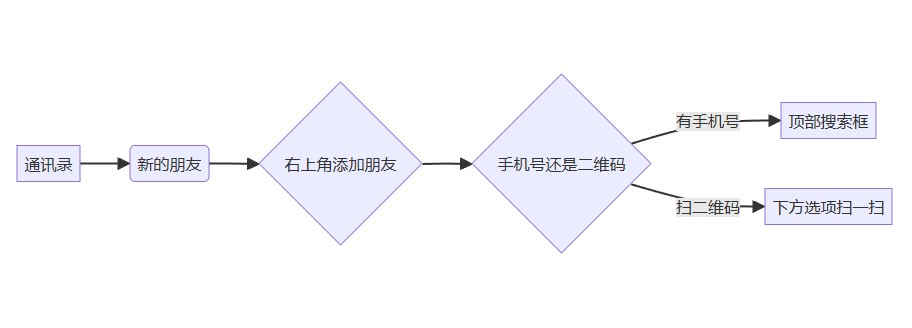
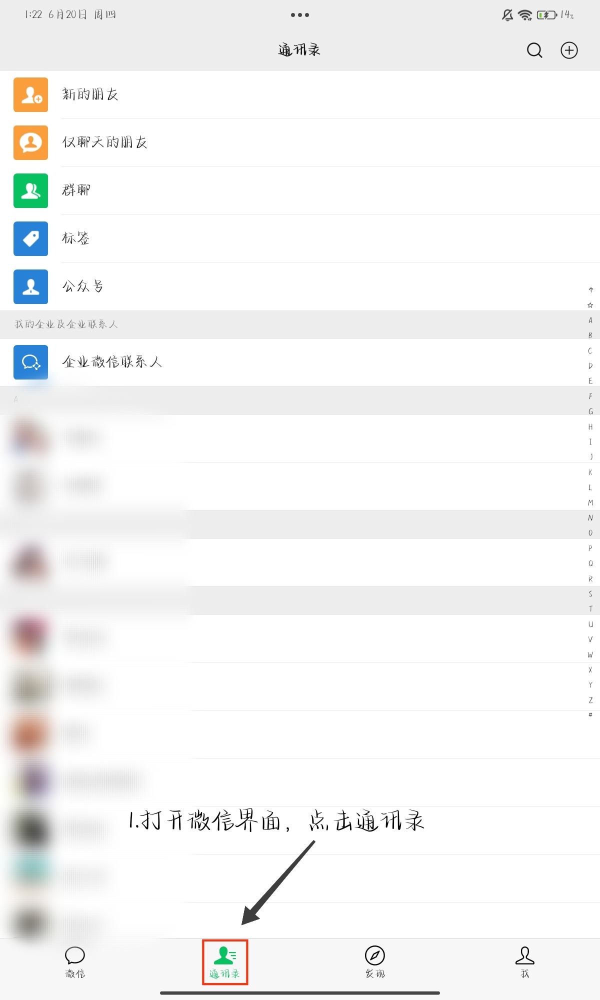
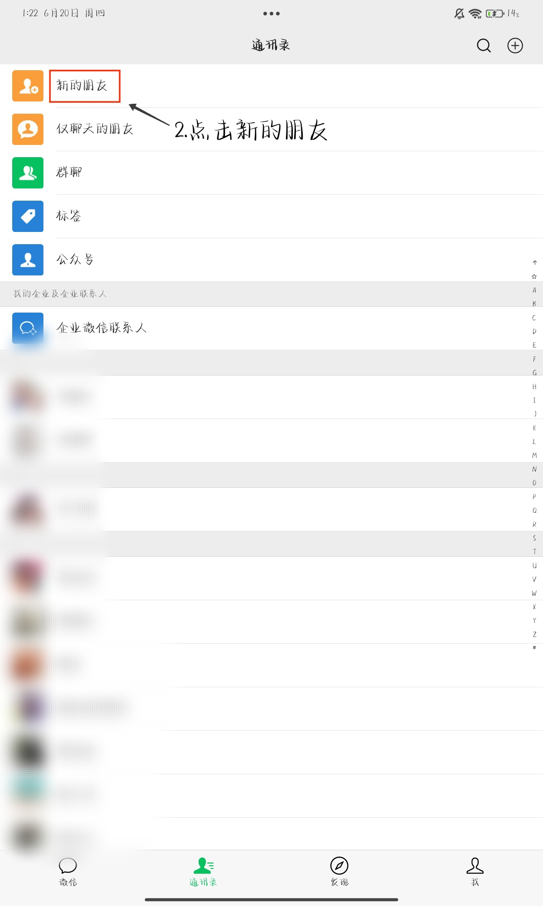
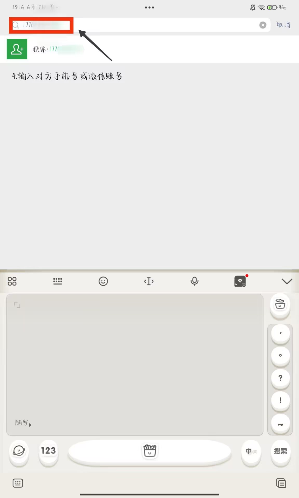
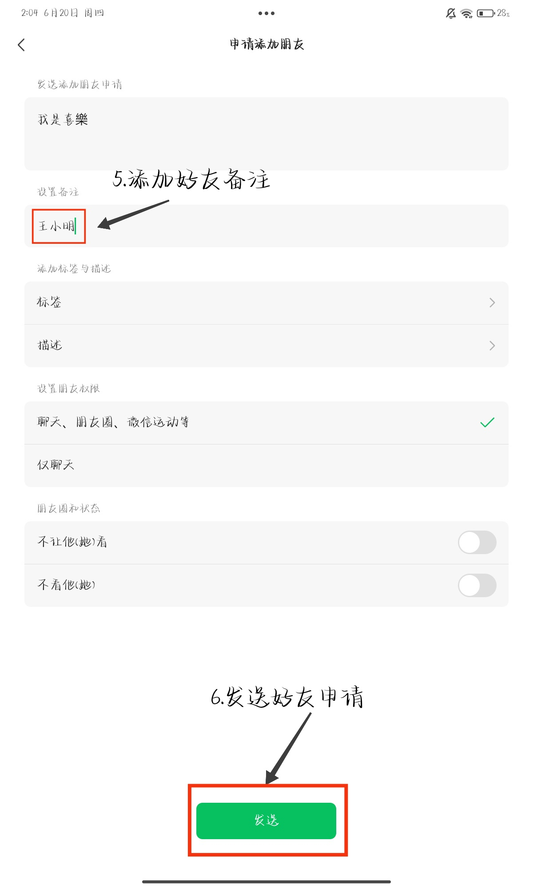
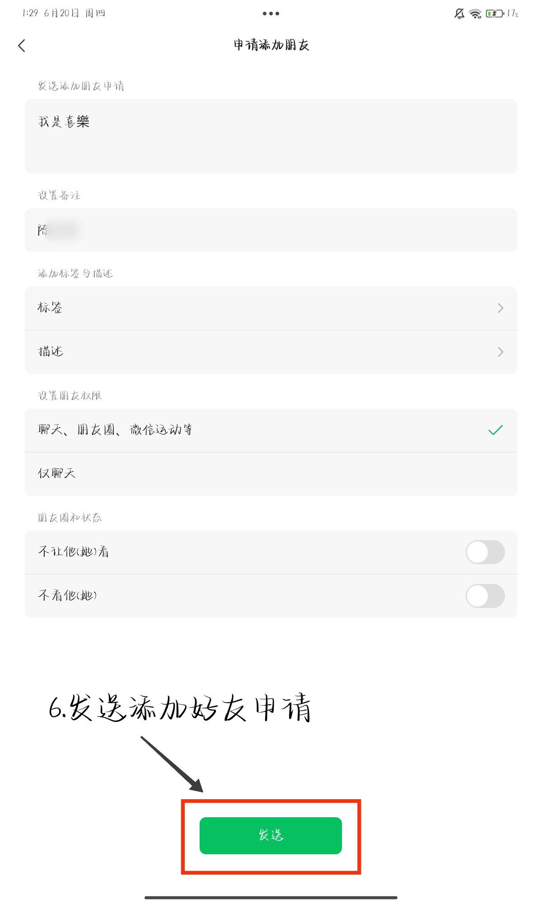

# 如何添加微信好友

　　添加微信好友的方法有很多种，本文主要讲述两种最常用的加好友方法—————**二维码扫描**和**手机号搜索**
  
## 操作流程图

## 详细教程
> 致谢:本篇教程图源来自于**喜樂**授权

## 手机号搜索
（本教程为了将好友管理统一在通讯录中进行，以减少记忆成本，故并不是最简步骤）

### 第一步：打开微信，点击屏幕下方的 “通讯录” 

### 第二步：点击屏幕上方 “新的朋友”

### 第三步：点击搜索框<mark>输入朋友的手机号或者微信号<mark>

### 第四步：点击搜索框下方选项，搜索：xxxxxxxxxxxx

### 第五步：点击第二行输入框，<mark>填入朋友的名字<mark>作为备注

### 第六步：在手机屏幕底部，点击 “提交申请”，等待朋友同意即可。

## 手机号搜索
**二维码扫描是所有加好友方式中最为直接与快捷的方式，现在让我们从第一步看起。**

#### 注释 (面向贡献者，老人可跳过此段)
1.思维导图由markdown生成:
>mermaid
>
>graph LR
>
>A[通讯录] -->B(新的朋友)
>
>    B --> C{右上角添加朋友}
>
>    C --> D{手机号还是二维码}
>
>    D -->|有手机号| E[顶部搜索框]
>
>    D -->|扫二维码| F[下方选项扫一扫]

