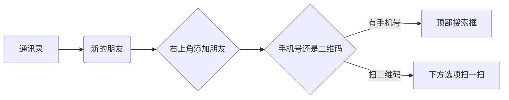

# 如何添加微信好友

　　添加微信好友的方法有很多种，本文主要讲述两种最常用的加好友方法—————**二维码扫描**和**手机号搜索**
  
## 操作流程图

## 详细教程
> 致谢:本篇教程图源来自于**喜樂**授权

## 二维码扫描
**二维码扫描是所有加好友方式中最为直接与快捷的方式，现在让我们从第一步看起。**

（本教程为了将好友管理统一在通讯录中进行，以减少老人的记忆成本，并不是最简步骤）

### 第一步：打开微信，点击屏幕下方的 “通讯录” 
### 第二步：点击屏幕上方 “新的朋友”
### 第三步：点击屏幕右上方 “添加朋友”
### 第四步：点击选项第三行 “扫一扫” 扫描朋友的二维码，即可进入朋友的资料页
### 第五步：点击屏幕下方的“添加到通讯录”
### 第六步：填写自己的名字在第一行，填写朋友名字在第二行，滑到手机底部，点击 “提交申请”，等待朋友同意即可。

## 手机号搜索

